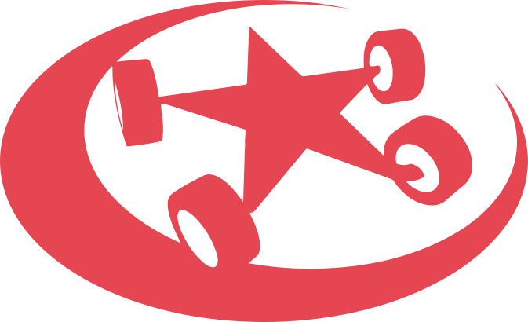

# Eurobot AV Dashboard

<div align="center">

</div>

A comprehensive platform for managing Eurobot competition events. This application provides real-time match management, score tracking, and live display functionality for broadcasting competitions.

## Features

- **Live Match Display**: Display team names and countdown timers on the live stream during active matches
- **Score Management**: Evaluate matches and display scores on the live screen when matches conclude
- **Real-time Updates**: WebSocket integration for instant score and match status updates
- **User Management**: Role-based access control for administrators, referees, and viewers
- **Dashboard Views**: Multiple dashboard views for different stakeholder roles (control center, referees, displays)
- **Score Calculation**: Automated score calculation with configurable scoring formulas
- **Round Management**: Organize and manage multiple rounds and matches

## Prerequisites

Before setting up the Eurobot AV Dashboard, ensure you have the following installed:

- **Docker**: Required to run the application in containers. Download from [Docker Desktop](https://docs.docker.com/desktop/)
- **Docker Compose**: Usually included with Docker Desktop
- **Git** (optional): For cloning the repository
- **Network Access**: Ensure your machine has network connectivity and ports 80, 3001, and 8081 are available

## Setup Instructions

### Step 1: Prerequisites

Ensure Docker Desktop is installed on your machine. For installation instructions, visit the [Docker Desktop documentation](https://docs.docker.com/desktop/).

### Step 2: Clone/Download Repository

Clone this repository or download it as a ZIP file:

```bash
git clone https://github.com/yourusername/Eurobot-Score-Platform.git
cd Eurobot-Score-Platform
```

### Step 3: Configure Environment Variables

1. Open the `docker-compose.yml` file in your text editor
2. Locate the `server` service section
3. Set the `CLIENT_URL` environment variable to your machine's IP address or hostname:

   ```yaml
   environment:
     - CLIENT_URL=http://192.168.0.10
   ```

   Replace `192.168.0.10` with your actual machine IP address. The server will only accept requests from this configured URL.

### Step 4: Configure Tasks and Scoring

Every Eurobot competition edition has different rules and tasks. Configure the task list and scoring in `Server/src/config/info.js`:

#### Task List Structure

Each task in the `taskList` array follows this pattern:

```js
{
    name: 'Task Name',           // Displayed on screen
    type: 'N' or 'B',            // 'N' for repeatable tasks, 'B' for binary (yes/no) tasks
    score: 5,                    // Points per task (for 'N': points per instance)
}
```

#### Example Configuration

```js
taskList = [
    {
        name: 'Plant valid in zone',
        type: 'N',
        score: 3,
    },
    {
        name: 'Robot in final zone',
        type: 'B',
        score: 10,
    },
];
```

#### Additional Configuration Options

The `info.js` file also contains:

- **`primaryColors`**: Team colors mapping (e.g., `team1: '#f7b500'`, `team2: '#005b8c'`)
- **`isEstimationActive`**: Enable/disable score estimation (0 or 1)
- **`year`**: Competition year for reference
- **`notEstimatedTaskList`**: Array of tasks to exclude from estimation (same structure as taskList)

### Step 5: Start the Application

Open your terminal/command prompt in the repository directory and run:

```bash
docker-compose up
```

Once finished, the AV dashboard Platform will be accessible on port 80.

### Step 6: Access the Application

Once the containers are running, access the platform at:

```
http://your-machine-ip-address
```

The live display for OBS/streaming can be accessed at:

```
http://your-machine-ip-address/display
```

## Managing the Application

### Stop Containers (Preserve Database)

To stop the containers while keeping the database intact:

```bash
docker-compose stop
```

### Start Containers (After Stop)

To restart previously stopped containers:

```bash
docker-compose start
```

### Remove Containers (Delete Database)

To completely remove containers and delete the database:

```bash
docker-compose down
```

## Default Credentials

- **Username**: `admin`
- **Password**: `admin`

⚠️ Change the default password immediately after first login in a production environment.

## Notes

- When running the application and need to restart the computer, use the `stop` command (the `down` command will erase the database)
- The backend server runs on port 3001 internally
- MongoDB Express (database management tool) is available on port 8081

## Additional Documentation

For detailed information about each component, please refer to:

- [Server Documentation](Server/README.md) - Backend API, routes, and development guide
- [Client Documentation](Client/README.md) - Frontend structure, components, and setup

## Contributing

To contribute improvements:

1. Fork the repository
2. Create a feature branch (`git checkout -b feature/improvement`)
3. Make your changes
4. Commit with clear messages
5. Push to the branch and submit a pull request

## Security Considerations

- Always change the default admin credentials in production
- Restrict CLIENT_URL to trusted network addresses only
